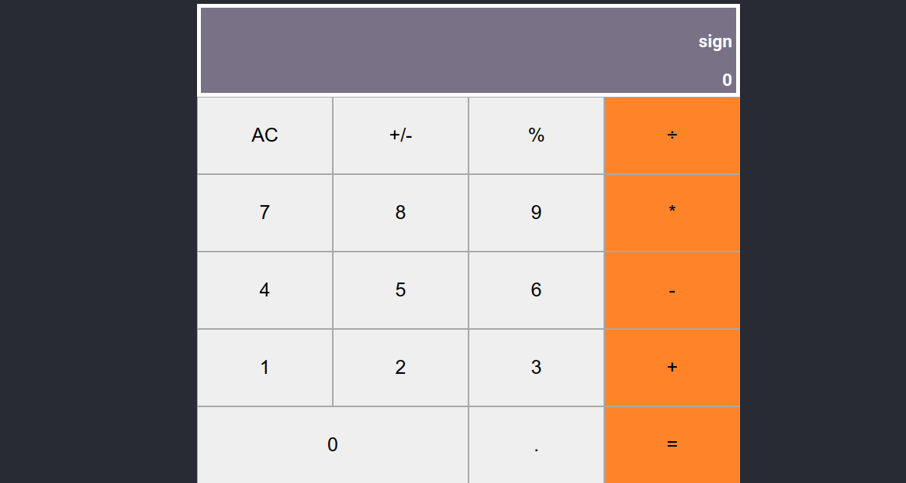
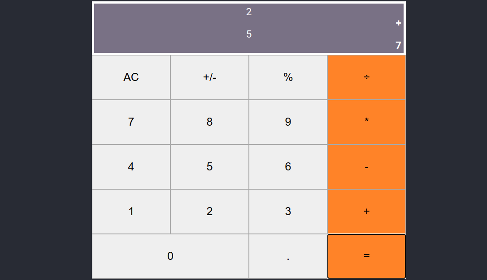

[![Contributor][contributor-shield]][contributor-url]
[![Issues][issues-shield]][issues-url]
 

 
  <h3 align="center">React Calculator</h3>
  

    React/Redux
     
    <a href="https://github.com/bafiam/react-calculator.git"><strong>Explore the docs »</strong></a>
     
     
    ·
    <a href="https://github.com/bafiam/react-calculator/issues">Report Bug</a>
    ·
    <a href="https://github.com/bafiam/react-calculator/issues">Request Feature</a>
  

<!-- TABLE OF CONTENTS -->

## Table of Contents

- [About the Project](#about-the-project)
- [Screenshots](#screenshots)
- [How to Use](#how-to-Use)
- [Roadmap](#roadmap)
- [License](#license)
- [Contact](#contact)

<!-- ABOUT THE PROJECT -->

## About The Project

This project involves building a calculator that performs basic arithmetical operations. The application is built using React Create-react-app and tests our understanding of react concepts such as components, classes and functions.

### Prerequisites

- Node

- Npm

- React

## Screenshots

### Home

### Calculations

### How to Use

Action keys [`=`, `AC`, `%`, `+/-`]--Double click to execute

`=` - execute the operations

`AC` - clear the inputs

`%` - convert to percentage

`+/-` - convert to negative or positive

### Built With

This project was built with react create-react-app

## Getting Started

- git clone https://github.com/bafiam/react-calculator.git

- cd react-calculator

- run **npm install**

- run **npm start**

## Live Version

- You can view the app [Here](https://protected-sierra-43792.herokuapp.com/)

<!-- ROADMAP -->

## Roadmap

See the [open issues](https://github.com/bafiam/react-calculator/issues) for a list of proposed features (and known issues).

<!-- CONTACT -->

## Contact

Stephen Gumba

- [Github profile](https://github.com/bafiam)

Project Link: [Project repo](https://github.com/bafiam/react-calculator)

<!-- MARKDOWN LINKS & IMAGES -->
<!-- https://www.markdownguide.org/basic-syntax/#reference-style-links -->

[contributor-shield]: https://img.shields.io/badge/Contributors-1-%2300ff00
[contributor-url]: https://github.com/bafiam/react-calculator/graphs/contributors
[issues-shield]: https://img.shields.io/badge/issues-0-%2300ff00
[issues-url]: https://github.com/bafiam/react-calculator/issues/
